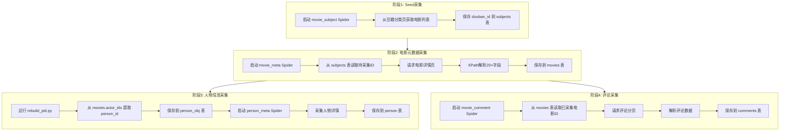
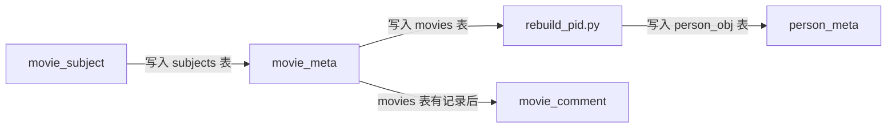
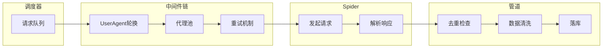
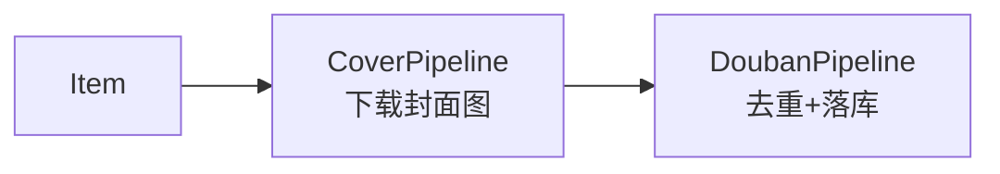
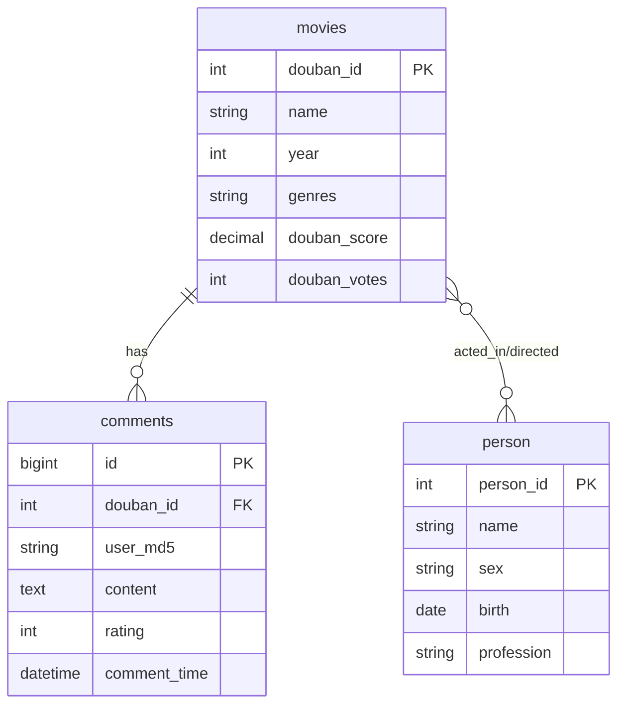

# db-spiders：豆瓣电影数据采集项目规格书

---

## 1. 项目概览

### 1.1 项目基本信息

| 项目     | 说明                                |
| -------- | ----------------------------------- |
| 项目名   | db-spiders                          |
| 框架     | Scrapy (Python 3)                   |
| 数据库   | MySQL 5.7+ (utf8mb4)                |
| 目标状态 | ✅ 可配置、可监控、可恢复的采集系统 |

### 1.2 采集边界

| 采集范围              | 说明     |
| --------------------- | -------- |
| 电影(Movie)数据采集   | 核心实体 |
| 演员/导演(Person)数据 | 人物信息 |
| 用户评论(Comment)数据 | 用户交互 |
| 用户评分(Rating)数据  | 用户行为 |

---

## 2. 技术栈与目录结构

### 2.1 技术栈

| 类别     | 技术    | 版本   | 用途      |
| -------- | ------- | ------ | --------- |
| 爬虫框架 | Scrapy  | -      | 核心采集  |
| 数据库   | PyMySQL | 0.9.3  | MySQL连接 |
| NLP      | jieba   | 0.39   | 中文分词  |
| 数据处理 | pandas  | 0.25.0 | 数据清洗  |

### 2.2 目录结构

```
db-spiders/
├── config/                  # 配置文件目录
│   └── spider_config.yaml  # 爬虫配置
├── scrapy/                  # Scrapy项目根目录
│   ├── scrapy.cfg          # Scrapy配置
│   ├── sql/douban.sql      # 数据库DDL
│   ├── start_*.sh          # 启动脚本
│   └── douban/             # 爬虫模块
│       ├── spiders/        # Spider定义
│       │   ├── movie_subject.py   # 电影ID采集
│       │   ├── movie_meta.py      # 电影元数据
│       │   ├── movie_comment.py   # 电影评论
│       │   └── person_meta.py     # 演员信息
│       ├── items.py        # Item定义
│       ├── pipelines.py    # 数据管道
│       ├── middlewares.py  # 中间件(代理/UA)
│       ├── settings.py     # Scrapy配置
│       ├── database.py     # 数据库连接
│       └── util.py         # 工具函数
└── data/                    # 输出数据目录
    ├── movies.csv
    ├── person.csv
    ├── users.csv
    ├── ratings.csv
    └── comments.csv
```

---

## 3. 爬虫流程设计

### 3.1 整体采集流程



### 3.2 Spider依赖关系



### 3.3 单次请求流程



---

## 4. 各Spider详细设计

### 4.1 movie_subject Spider

| 属性     | 值                          |
| -------- | --------------------------- |
| 职责     | 从豆瓣分类页获取电影ID种子  |
| 入口URL  | 豆瓣电影分类/推荐页         |
| 输出表   | `subjects`                  |
| 输出字段 | `douban_id`, `type='movie'` |
| 去重逻辑 | 基于 `douban_id` 去重       |

### 4.2 movie_meta Spider

| 属性     | 值                                                                                              |
| -------- | ----------------------------------------------------------------------------------------------- |
| 职责     | 采集电影详情页元数据                                                                            |
| 种子SQL  | `SELECT * FROM subjects WHERE type="movie" AND douban_id NOT IN (SELECT douban_id FROM movies)` |
| 输出表   | `movies`                                                                                        |
| 核心字段 | name, year, genres, directors, actors, score, storyline 等20+字段                               |
| 去重逻辑 | SELECT查询 → INSERT新记录 / UPDATE已有记录                                                      |

**XPath解析规则：**

| 字段         | XPath / 选择器          |
| ------------ | ----------------------- |
| name         | `<title>`               |
| douban_score | `v:average`             |
| douban_votes | `v:votes`               |
| genres       | `v:genre`               |
| directors    | `v:directedBy`          |
| actors       | `v:starring`            |
| year         | `.year`                 |
| storyline    | `v:summary`             |
| release_date | `v:initialReleaseDate`  |
| languages    | `语言:` 后文本          |
| regions      | `制片国家/地区:` 后文本 |

### 4.3 person_meta Spider

| 属性     | 值                                                                                       |
| -------- | ---------------------------------------------------------------------------------------- |
| 职责     | 采集演员/导演详情页                                                                      |
| 前置依赖 | 需先运行 `rebuild_pid.py` 从 movies 表提取 person_id                                     |
| 种子SQL  | `SELECT person_id FROM person_obj WHERE person_id NOT IN (SELECT person_id FROM person)` |
| 输出表   | `person`                                                                                 |
| 核心字段 | name, sex, birth, birthplace, profession, biography                                      |

### 4.4 movie_comment Spider

| 属性     | 值                                                                                              |
| -------- | ----------------------------------------------------------------------------------------------- |
| 职责     | 采集电影评论与评分                                                                              |
| 种子SQL  | `SELECT douban_id FROM movies WHERE douban_id NOT IN (SELECT DISTINCT douban_id FROM comments)` |
| 输出表   | `comments`                                                                                      |
| 核心字段 | user_id, user_md5, content, rating, votes, comment_time                                         |
| 分页处理 | 按评论分页遍历，直到无更多评论                                                                  |

---

## 5. 中间件设计

### 5.1 中间件链

| 中间件                      | 优先级 | 职责         |
| --------------------------- | ------ | ------------ |
| `RandomUserAgentMiddleware` | 400    | UA轮换       |
| `ProxyMiddleware`           | 500    | 代理池管理   |
| `RetryMiddleware`           | 550    | 指数退避重试 |

### 5.2 UserAgent轮换

```python
class RandomUserAgentMiddleware:
    """从预定义列表随机选择UA"""
    user_agents = [...]

    def process_request(self, request, spider):
        request.headers['User-Agent'] = random.choice(self.user_agents)
```

### 5.3 代理池设计

```python
class ProxyMiddleware:
    """从数据库/API获取代理，支持健康检查"""

    def process_request(self, request, spider):
        proxy = self.get_healthy_proxy()
        request.meta['proxy'] = proxy

    def process_exception(self, request, exception, spider):
        # 标记失败代理，触发重试
        self.mark_proxy_failed(request.meta['proxy'])
```

### 5.4 重试与退避策略

```yaml
# config/spider_config.yaml
retry:
    enabled: true
    max_retries: 3
    backoff_factor: 2 # 重试间隔: 1s, 2s, 4s
    retry_http_codes: [500, 502, 503, 504, 408, 429]
```

---

## 6. 数据管道设计

### 6.1 管道链



### 6.2 去重逻辑

```python
class DoubanPipeline:
    def process_item(self, item, spider):
        if isinstance(item, MovieMeta):
            existing = self.get_movie_meta(item['douban_id'])
            if existing:
                self.update_movie_meta(item)
            else:
                self.save_movie_meta(item)
        return item
```

### 6.3 数据清洗规则

| 字段         | 清洗规则                      |
| ------------ | ----------------------------- |
| year         | 正则提取4位年份               |
| release_date | 多种格式统一转换为 YYYY-MM-DD |
| genres       | `/` 分隔 → 数组               |
| actor_ids    | `姓名:ID` 格式解析            |

---

## 7. 数据模型

### 7.1 核心表结构

```sql
-- 电影表
CREATE TABLE movies (
    douban_id INT PRIMARY KEY,
    name VARCHAR(255) NOT NULL,
    alias VARCHAR(255),
    year SMALLINT,
    genres VARCHAR(255),
    regions VARCHAR(255),
    languages VARCHAR(255),
    mins SMALLINT,
    storyline TEXT,
    douban_score DECIMAL(3,1),
    douban_votes INT,
    actor_ids TEXT,
    director_ids TEXT,
    created_at TIMESTAMP DEFAULT CURRENT_TIMESTAMP,
    updated_at TIMESTAMP DEFAULT CURRENT_TIMESTAMP ON UPDATE CURRENT_TIMESTAMP
);

-- 人物表
CREATE TABLE person (
    person_id INT PRIMARY KEY,
    name VARCHAR(255) NOT NULL,
    sex ENUM('男', '女'),
    birth DATE,
    birthplace VARCHAR(255),
    profession VARCHAR(255),
    biography TEXT
);

-- 评论表
CREATE TABLE comments (
    id BIGINT AUTO_INCREMENT PRIMARY KEY,
    douban_comment_id BIGINT UNIQUE,
    douban_id INT,
    user_md5 VARCHAR(32),
    content TEXT,
    rating TINYINT,
    votes INT,
    comment_time DATETIME,
    INDEX idx_movie (douban_id),
    INDEX idx_user (user_md5)
);
```

### 7.2 ER图



---

## 8. 配置管理

### 8.1 Scrapy配置 (settings.py)

```python
# 并发控制
CONCURRENT_REQUESTS = 16
CONCURRENT_REQUESTS_PER_DOMAIN = 4
DOWNLOAD_DELAY = 2

# 中间件
DOWNLOADER_MIDDLEWARES = {
    'douban.middlewares.RandomUserAgentMiddleware': 400,
    'douban.middlewares.ProxyMiddleware': 500,
}

# 管道
ITEM_PIPELINES = {
    'douban.pipelines.CoverPipeline': 100,
    'douban.pipelines.DoubanPipeline': 300,
}

# 重试
RETRY_ENABLED = True
RETRY_TIMES = 3
```

### 8.2 爬虫配置 (spider_config.yaml)

```yaml
rate_limits:
    movie.douban.com:
        requests_per_second: 0.5
        concurrent_per_ip: 2

proxy:
    provider: "configurable"
    pool_size: 100
    health_check_interval: 60

logging:
    format: "json"
    level: "INFO"
```

---

## 9. 运行指南

### 9.1 启动顺序

```bash
# 1. 初始化数据库
mysql -u root -p < scrapy/sql/douban.sql

# 2. 采集电影ID种子
cd scrapy && scrapy crawl movie_subject

# 3. 采集电影元数据
scrapy crawl movie_meta

# 4. 提取人物ID
python rebuild_pid.py

# 5. 采集人物信息
scrapy crawl person_meta

# 6. 采集评论
scrapy crawl movie_comment
```

### 9.2 增量采集

各Spider内置增量逻辑，通过SQL筛选未采集记录：

```sql
-- movie_meta: 采集subjects中未处理的电影
SELECT * FROM subjects WHERE douban_id NOT IN (SELECT douban_id FROM movies)

-- 只需重复执行相同命令即可增量采集
scrapy crawl movie_meta
```

---

## 10. 风险与验证

### 10.1 关键验证项

| 验证项         | 验证方法                    | 验收标准           |
| -------------- | --------------------------- | ------------------ |
| 页面结构可解析 | 手动访问电影详情页对照XPath | 核心字段能正确提取 |
| 评分可采集     | 采集10部热门电影            | douban_score非0    |
| 增量去重正确   | 同一电影采集两次            | 无重复记录         |
| 代理池有效     | 连续请求100次               | 成功率>90%         |
| 人物ID解析正确 | 采集一部多演员电影          | actor_ids格式正确  |

### 10.2 风险矩阵

| 风险         | 可能性 | 影响      | 缓解措施                 |
| ------------ | ------ | --------- | ------------------------ |
| 页面结构变化 | 高     | 🔴 阻塞   | 准备多套XPath，定期验证  |
| IP被封       | 高     | 🟡 降速   | 低并发 + 代理池 + 长间隔 |
| 评论分页变化 | 中     | 🟡 丢数据 | 监控采集完整性           |

---

_文档版本: 1.0_  
_创建时间: 2026-01-30_  
_项目名称: db-spiders_

---

## 11. 分阶段执行清单与验收

> 目标：每阶段形成可验证的最小闭环，降低联调与排障成本。

### 11.1 阶段1：Seed + 电影元数据最小闭环

**执行范围**

- movie_subject → subjects 表
- movie_meta → movies 表

**执行清单**

- 初始化数据库（导入 DDL）
- 运行 movie_subject 抓取种子
- 运行 movie_meta 抓取电影详情
- 验证去重逻辑与增量 SQL

**验收标准**

- subjects 表有新增记录，douban_id 唯一
- movies 表核心字段（name、year、score）非空
- 重复运行 movie_meta 无重复写入（只更新或跳过）

### 11.2 阶段2：人物信息采集

**执行范围**

- rebuild_pid.py → person_obj 表
- person_meta → person 表

**执行清单**

- 运行 rebuild_pid.py 提取 person_id
- 运行 person_meta 抓取人物详情
- 校验 actor_ids / director_ids 解析结果

**验收标准**

- person_obj 表 person_id 去重成功
- person 表核心字段（name、profession）非空
- 人物详情页解析稳定（随机抽检 10 条）

### 11.3 阶段3：评论与评分采集

**执行范围**

- movie_comment → comments 表

**执行清单**

- 运行 movie_comment 抓取评论分页
- 校验分页终止条件
- 校验评分与评论时间解析

**验收标准**

- comments 表新增记录，comment_time 格式正确
- 评分字段在预期范围（1~5）
- 10 部电影评论数量非 0

### 11.4 阶段4（可选）：稳定性与性能

**执行范围**

- 代理池健康检查
- 重试与退避策略
- 并发与限速参数

**执行清单**

- 验证代理池成功率
- 调整并发与延迟配置
- 日志结构化输出检查

**验收标准**

- 100 次请求成功率 ≥ 90%
- 平均响应时间在可接受范围
- 采集过程无明显异常波动
