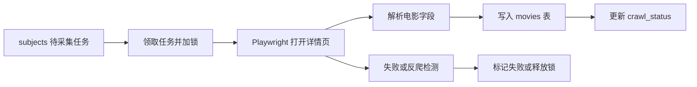
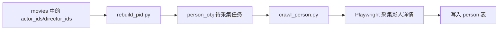

# 数据采集子系统实现说明

**状态**: 当前实现说明，取代旧版 Scrapy 规划书
**修订日期**: 2026-05-01

旧版文档中的 Scrapy 项目结构、评论采集和 NLP 处理描述已删除。当前仓库的数据采集子系统位于 `db-spiders/`，核心实现为 Playwright 爬虫。

## 1. 子系统范围

| 文件 | 作用 |
|---|---|
| `crawl_movie.py` | 电影详情采集，支持多 worker、任务锁、失败标记和断点恢复 |
| `crawl_person.py` | 影人详情采集，支持异步 Playwright、代理池/直连模式和渐进 worker |
| `rebuild_pid.py` | 从 `movies.actor_ids`、`movies.director_ids` 提取影人 ID，写入 `person_obj` |
| `discover_movies.py` | 电影条目发现 |
| `recrawl_incomplete_movies.py` | 电影缺失字段补采 |
| `recrawl_incomplete_persons.py` | 影人缺失字段补采 |
| `db_spiders/database.py` | MySQL 连接 |
| `db_spiders/validator.py` | 字段校验 |

## 2. 电影采集流程

`crawl_movie.py` 使用 `crawl_status`、`crawl_locked_at`、`crawl_worker` 控制任务状态，并使用 `FOR UPDATE SKIP LOCKED` 避免多个 worker 重复领取同一任务。

## 3. 影人采集流程

`crawl_person.py` 支持代理池模式和保守直连模式，可按 IP 逐步增加 worker，并在异常时退避或标记失败。

## 4. 论文可写边界

可写：

- Playwright 浏览器自动化采集。
- MySQL 任务状态表驱动的断点恢复和任务锁。
- 电影与影人采集分离。
- 字段校验、失败标记和缺失字段补采。

不可写：

- Scrapy 是当前核心采集框架。
- 已实现评论全文采集或影评舆情分析。
- HanLP 实体抽取。
- 大规模分布式生产部署性能指标。
